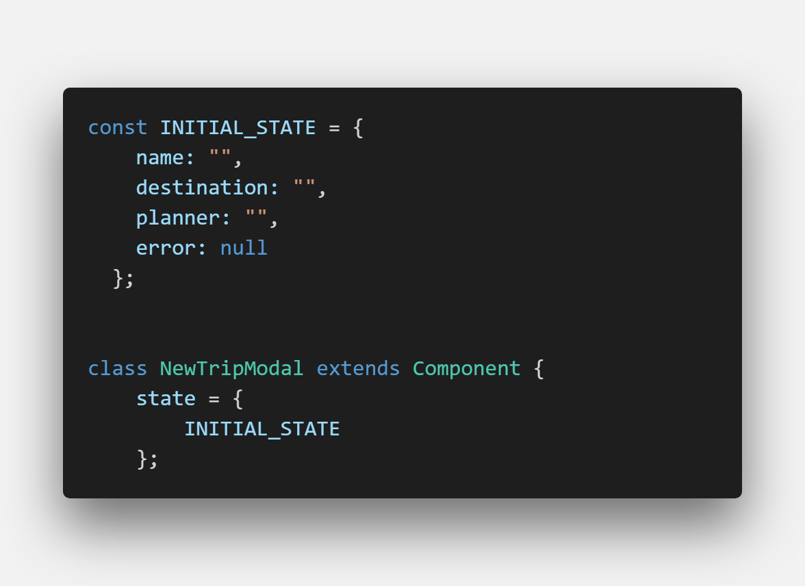

## Understanding the sprint guidelines
This sprint was mainly concentrating on responsive design and styling. As well as getting the front and backend connected together

## Individual progress

Overall, I feel my individual progress this sprint was better. I had some issues in terms of time and figuring things out, but I feel I did a good enough job on things. I was able to learn FakerJS and seed 500 users into a JSON file, and submit a Pull Request so our firebase person could import it into the database.

I also was able to learn the frontend codebase, and read up on React a bit because I've been out of the loop since I've been doing backend related tasks for the project and build week. I modified the state of NewTripModal.js to include the details for a new trip,
and started building the submit handler function. I still have to learn Hooks some, but I'm pretty confident that I'll be able to pick it up. This is a screenshot of the code I modified to our codebase.

I had to change the state, because it was built first off on a whim. So, in order to get our frontend ready to be connected the state needed to be modified with the correct information. 