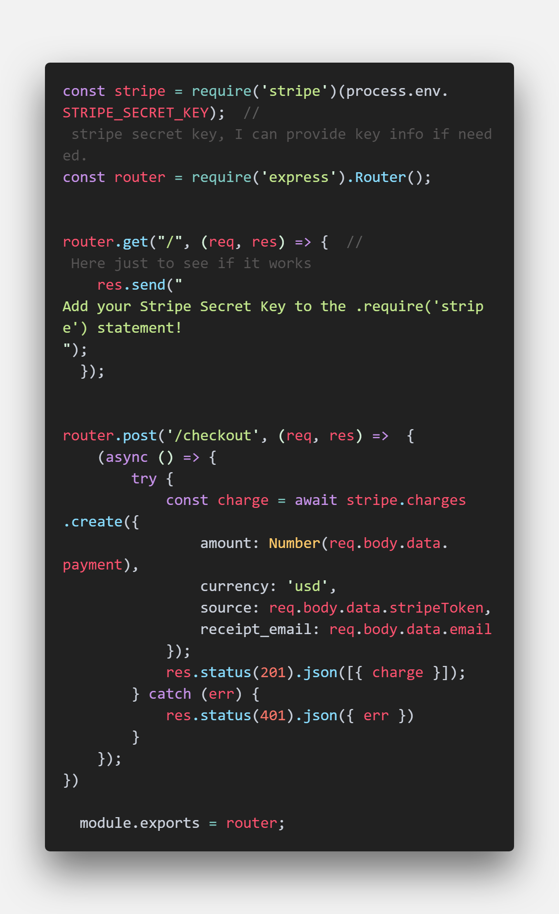
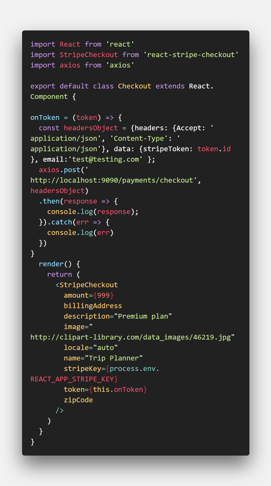

## Understanding the sprint guidelines
The focus of this sprint was to fix any remaining bugs and make the project presentable to a group.

## Individual Progress
I felt the week went okay, I was tasked with getting Stripe running on the back and front end of our project. I had some difficulty starting off,because Stripe has a lot going on. We ended up using Stripe Checkout which is different compared to the other ones. My main blocker was understanding hwo everything got connected, I believe I was misunderstanding Stripe in general. I have attached an image showing the code I worked on during the first half of the week until it was finished.

## Weekly Reflection
For the remainder of the sprint, I started working on the frontend portion of Stripe. This part was the most difficult since I haven't had to learn anything new for a while now. I mainly had difficulty understanding how it would be tested when Stripe was integrated. I ran into a few problems, but was able to overcome them through the assistance of our PM in a Zoom call. I feel I could have done a better job over all this week, as the Stripe integration was starting to take longer than it should have. The code for the frontend portion of Stripe can be seen below

Overall on a whole, I feel I could have done a lot better. The team I had for Labs was great, everyone worked together and got along without any issues. We had some communication issues at first, but that got sorted out. For the start of the project, the difficult thing was just figuring out what technologies we wanted to use. None us knew firebase, so it was a brand new technology to us. However, once we starting getting further along with the project, it became easier to understand.

For me personally, the difficult thing was managing time and asking questions when I'm blocked. I have a tendency to sit on an issue longer than the 30 minute rule without asking for assistance. Also, a difficult thing for me is to explain what I'm doing and why to someone else. Working on a team was an interesting experience for me, it let me see the weaknesses I have when it comes to a team environment.